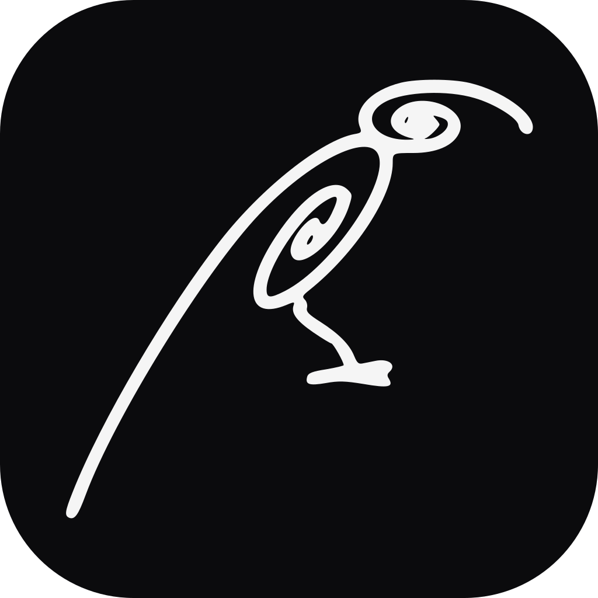
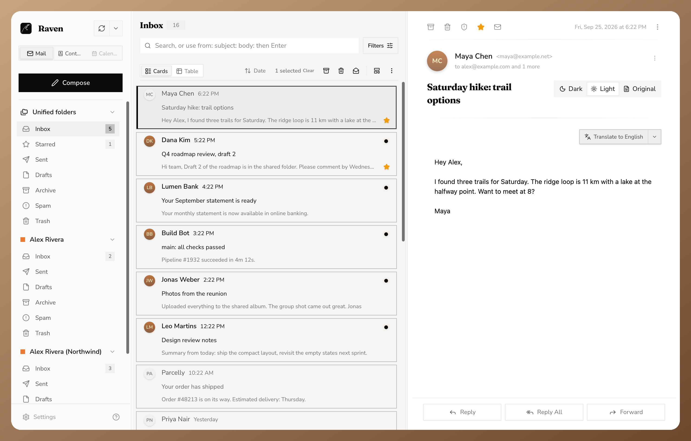
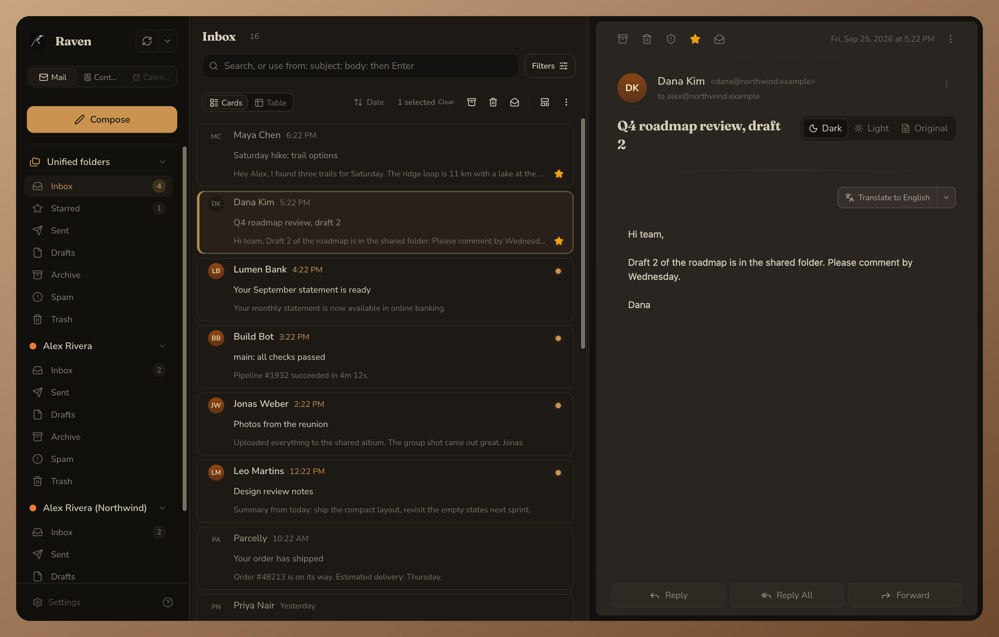

<h1>
  
  Raven
</h1>

| Minimal light | Classic dark |
| --- | --- |
|  |  |

[View all screenshots](./screenshots/README.md) · Screenshots use made-up demo data.

<br>

Raven is a local-first email client. I maintain it as a fork of [Gofer](https://github.com/cristianadrielbraun/gofer), built by Cristián Braun, and use it under the MIT License. Raven isn't affiliated with or endorsed by the Gofer project. Most of the mail engine, sync and UI is Cristián's work. I follow upstream closely and send general fixes back to Gofer.

It's built with Go, templ views, HTMX-style interactions, and SQLite storage. It runs on your own machine, keeps mail and related data local, and talks directly to mail and contact providers. Generic accounts use IMAP/SMTP. Gmail uses the Gmail API and Google People API. Outlook uses Microsoft Graph.

## what Raven adds

- **Raven branding:** name, logo, and app manifest.
- **Desktop app:** a Tauri wrapper in [`tauri-wrapper/`](./tauri-wrapper) that runs the server in its own native window, with a GitHub Actions workflow that builds macOS, Linux, and Windows bundles.

## features

Everything below comes from Gofer and works in Raven:

- **Accounts and sync:** multiple IMAP/SMTP, Gmail, and Outlook accounts, with mail cached locally in SQLite.
- **Reading and sending:** threads, attachments, drafts with autosave, signatures, scheduled send, and translation.
- **Organization and search:** folders, stars, archive, spam controls, and advanced search filters.
- **Contacts:** local address books, vCard import/export, Google, Outlook, and CardDAV sync, plus automatic contact syncing between accounts.
- **Security:** encrypted stored credentials, remote content blocked by default, and optional authentication with passwords, TOTP, passkeys, or external sign-in.
- **Access modes:** no-login local use, one protected personal profile, or managed users with separate administrators.
- **Customization:** themes, layouts, account colors, regional settings, and browser/Web Push notifications.

## status

Raven is alpha software, like Gofer. Expect things to change. For upstream plans, see the [Gofer repository](https://github.com/cristianadrielbraun/gofer).

## running and building

Downloaded release binaries include the web assets. Development from source requires Go, `templ`, `tailwindcss`, and `task`.

```sh
task dev      # development server with hot reload
task build    # local build at ./tmp/main
task release  # self-contained binary at ./dist/gofer
```

With the development server running, open `http://local.localhost:8090`. See the [Taskfile](./Taskfile.yml) for packaging and other build tasks.

## setup and configuration

Raven runs locally without a login by default. It also supports personal mode (one protected profile with multiple mailboxes) and managed mode (separate administrators and webmail users). See [`.env.example`](./.env.example) for configuration options. Authenticated modes guide you through first-run setup using a token printed in the terminal.

Generic IMAP/SMTP accounts need no OAuth application credentials. Gmail and Outlook currently require your own provider client ID and secret. Mailbox authorization and optional Google/Microsoft application sign-in use separate clients and callbacks.

Runtime data is stored in `data/` by default. Keep it and your secrets private. The default listener is loopback-only; remote access requires explicit configuration.

## admin panel

In managed mode, `/admin` provides user administration, invitations, security policies, and security activity. It also includes diagnostics for account sync, contacts, avatars, and provider behavior.

## built with

Raven and Gofer are built on these libraries and tools:

- [templ](https://templ.guide/) for Go-based views
- [templUI](https://templui.io/) for several UI components
- [HTMX](https://htmx.org/) for server-driven interactions
- [Tailwind CSS](https://tailwindcss.com/) for styling
- [modernc.org/sqlite](https://pkg.go.dev/modernc.org/sqlite) for SQLite storage
- [emersion](https://github.com/emersion)'s Go mail libraries, including [go-imap](https://github.com/emersion/go-imap), [go-smtp](https://github.com/emersion/go-smtp), [go-message](https://github.com/emersion/go-message), [go-sasl](https://github.com/emersion/go-sasl), and [go-vcard](https://github.com/emersion/go-vcard), which provide much of Raven's mail, MIME, auth, and contact-format foundation
- [golang.org/x/oauth2](https://pkg.go.dev/golang.org/x/oauth2) for OAuth flows
- [webpush-go](https://github.com/SherClockHolmes/webpush-go) for Web Push notifications
- [Lucide](https://lucide.dev/) icons through templUI's icon component
